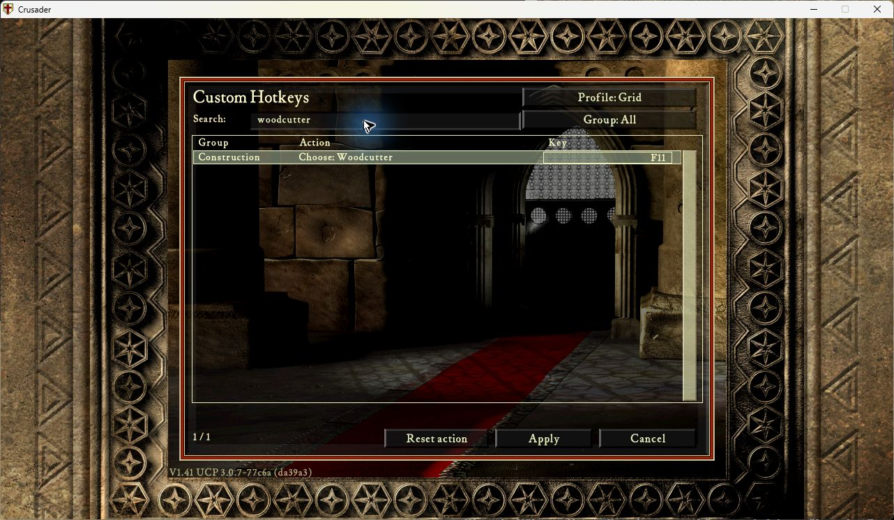
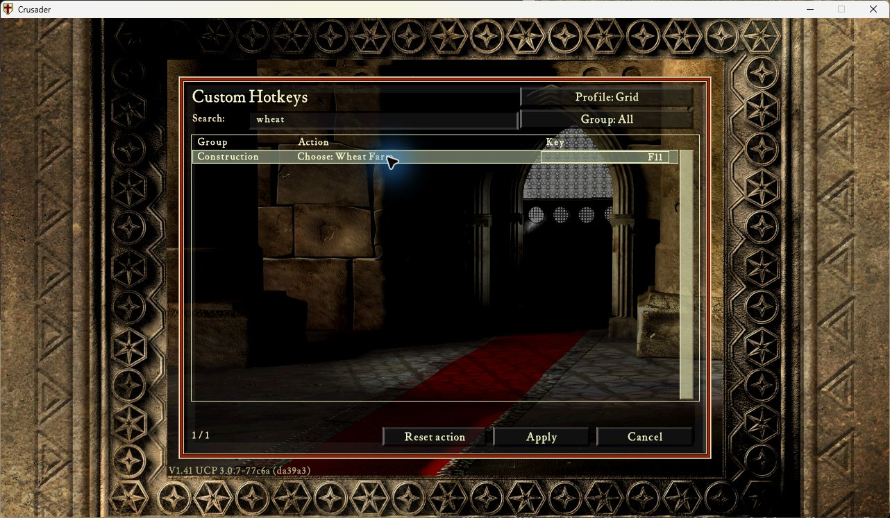

# Custom Hotkeys 0.1.9

**TL;DR:** Rebind keyboard/mouse controls in-game, save profiles, and try Game
Default, Modern RTS or Grid. **0.1.9 allows one key in separate native panels**:
Woodcutter, Wheat Farm and Catapult can share a key. Activate the module and
press **F12**.

[Download Custom Hotkeys 0.1.9](custom-hotkeys-0.1.9.zip?raw=true).

Put the ZIP in `ucp/modules`, select 0.1.9 and activate it. No second activation
switch or replacement framework files. Uses the existing UCP 3.0.7 AOB scanner,
cache and extractor; requires UI 1.0.1, LuaJIT/cffi/winProcHandler 1.0.0 and
graphicsApiReplacer 1.3.0. Legacy is optional; conflicting `o_keys.enabled` is
required false. Eleven editor languages follow the loaded game text with UCP's
game-language setting as fallback. Existing profiles and preset keys are preserved.

Woodcutter and Quarry still conflict because they share Industry. Global actions
also conflict wherever they overlap. The same explicit native-panel metadata is
used for validation and dispatch; hidden controls keep their native eligibility
checks. Held keys cannot activate a new panel until released. Finer conditions
within the same panel remain conservative; this does not establish priority
between simultaneously available actions.

Ctrl+number assigns a selected owned building or native unit group; number
recalls it, repeated number focuses it, and Alt+number focuses directly.
Shift+Alt+number stores a camera position; Ctrl+Alt+number recalls it.
Numpad 8/4/2/6 moves the target, Shift makes fine adjustments, 5 centers,
Enter confirms and Decimal cancels. Earlier profiles keep their bindings:
reset a preset for new defaults or assign the new actions individually.

Multiplayer, Recorder and Automarket are open for testing, including playback.
No Hotkeys Recorder-version or playback activation lock. Native game rules,
text-field focus and current menu ownership still apply. The optional
[Recorder 0.50.4 preview](recorder-integration/recorder-0.50.4.zip?raw=true) is unchanged.

Validation: **615 component tests**, both CI jobs green. The native panel table
(type/parameter/skip/condition/help, 297 rows) agrees across six available
Crusader/Extreme executable fixtures; [boundary audit](custom-hotkeys-0.1.9.boundaries.json).
Native Crusader editor
accepted F11 for both Woodcutter and Wheat Farm, applied successfully and reopened.
Both bindings were verified in the saved profile with a valid checksum. Runtime
files were unchanged; the game closed normally and the desktop was released.
Cross-panel dispatch, reload and held/text/focus/replay boundaries were tested in
components; gameplay dispatch and process restart were not exercised natively in
this check. [Exact native/package receipt](custom-hotkeys-0.1.9.native.json).

ZIP: **112,933 bytes**, SHA256
`a16174d3389cac2c7f2e79a1d47d8a17c97404b54617074653d835dbc92a83a1`. Repeat build byte-identical.
Source `9db157fd3147f0d3446e8de17adcff8f76993b4a`.
[Change and boundary details](https://github.com/Krarilotus/extension-custom-hotkeys/blob/9db157fd3147f0d3446e8de17adcff8f76993b4a/docs/features-0.1.9.md).

Unsigned development preview. Two-PC multiplayer is deferred to manual testing.
Full keyboard/text/held/focus/mouse acceptance, alternate-profile replay/state
restore, high-speed simulation, expanded Extreme gameplay and additional
executable/font/IME/RTL coverage remain unverified. These are test gaps, not
feature activation locks. Source [PR2](https://github.com/Krarilotus/extension-custom-hotkeys/pull/2) is merged into `main`; the recipe uses the tested `v0.1.9` tag. Store release acceptance remains under review in [PR41](https://github.com/UnofficialCrusaderPatch/UCP3-extensions-store/pull/41).

Earlier immutable downloads:
[0.1.8](custom-hotkeys-0.1.8.zip?raw=true),
[0.1.7](custom-hotkeys-0.1.7.zip?raw=true),
[0.1.6](custom-hotkeys-0.1.6.zip?raw=true),
[0.1.5](custom-hotkeys-0.1.5.zip?raw=true),
[0.1.4](custom-hotkeys-0.1.4.zip?raw=true),
[0.1.3](custom-hotkeys-0.1.3.zip?raw=true),
[0.1.2](recorder-integration/custom-hotkeys-0.1.2.zip?raw=true),
[0.1.1](custom-hotkeys-0.1.1.zip?raw=true).
