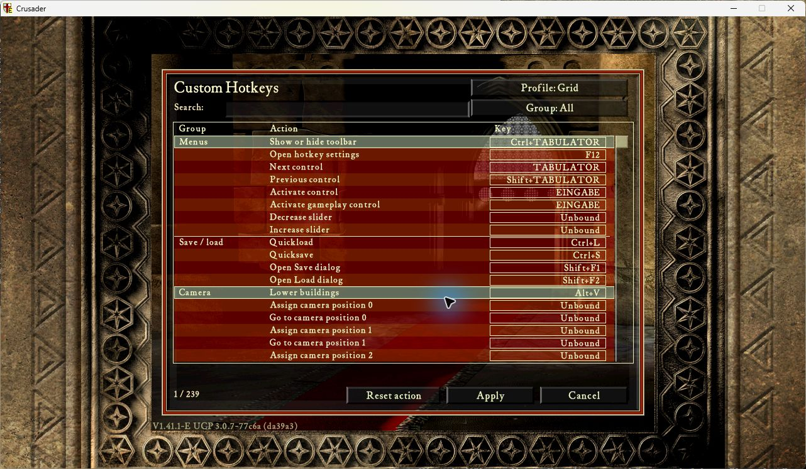

# Custom Hotkeys 0.1.8

**TL;DR:** Rebind keyboard and mouse controls in-game, save profiles, assign
building groups and camera positions, and try Game Default, Modern RTS or Grid.
Activate the module and press **F12**. Building shortcuts preserve your cursor.
0.1.8 fixes an overlapping player-lord signature and uses the existing UCP
scanner, cache and operand decoder. No replacement framework files are needed.

[Download Custom Hotkeys 0.1.8](custom-hotkeys-0.1.8.zip?raw=true).

Put the ZIP in `ucp/modules`, select this version and activate it. No second
activation switch. Requires UCP 3.0.7+, UI 1.0.1, LuaJIT/cffi/winProcHandler 1.0.0
and graphicsApiReplacer 1.3.0. Legacy is optional; conflicting `o_keys.enabled`
is required false by the module configuration. All nine Store descriptions
explain opening the editor. Eleven editor languages follow the loaded game text,
with UCP's game-language setting as fallback.

Ctrl+number assigns a selected owned building or native unit group; number
recalls it, repeated number focuses it, and Alt+number focuses directly.
Shift+Alt+number stores a camera position; Ctrl+Alt+number recalls it.
Numpad 8/4/2/6 moves the target, Shift makes fine adjustments, 5 centers,
Enter confirms and Decimal cancels. Earlier profiles keep their bindings:
reset a preset for new defaults or assign the new actions individually.

Multiplayer, Recorder and Automarket are open for testing, including playback.
No Hotkeys Recorder-version or playback activation lock. Native game rules,
text-field focus and current menu ownership still apply. The optional
[Recorder 0.50.4 preview](recorder-integration/recorder-0.50.4.zip?raw=true) is unchanged.

Validation: all 155 patterns have one overlapping-aware code match on six
available Crusader/Extreme executable fixtures. All 171 resolved values match
the prior expected values, using the actual stock UCP 3.0.7 Lua APIs for
resolution and extraction. This is an offline audit, not an added runtime
second-match check. No pending UCP/RPS API proposal is a dependency.

The reproducible ZIP is **112,301 bytes**, SHA256
`5aa42016fe817ec11f450c57cdb7f6444d7d16ad2160289023607dff519f6c1a`,
source `20f876621e5a5a4def9d530036cc0519ac84c486`. Repeat build is byte-identical.
Only the player-lord pattern, version and package documentation/receipt differ
from 0.1.7. Existing controls, profiles and all eleven editor languages remain.

Native startup and physical-F12 main-menu editor checks passed in both Crusader
and Extreme with the existing UCP runtime, Recorder 0.50.4 and Automarket 1.1.0
loaded. Both error logs are clear. Both games closed normally and the test state
was restored. Gameplay/replay were not exercised in these smoke runs.
Both component CI jobs passed; 37 focused resolver/package/locale checks passed.
[Exact package and native receipt](custom-hotkeys-0.1.8.native.json).

[0.1.8 change and scope](https://github.com/Krarilotus/extension-custom-hotkeys/blob/20f876621e5a5a4def9d530036cc0519ac84c486/docs/features-0.1.8.md).

Unsigned development preview. Two-PC multiplayer is deferred to manual testing.
Full keyboard/text/held/focus/mouse acceptance, alternate-profile replay/state
restore, high-speed simulation, expanded Extreme gameplay and additional
executable/font/IME/RTL coverage remain unverified. These are test gaps, not
feature activation locks. No completed acceptance or verified merge is claimed.

Earlier immutable downloads:
[0.1.7](custom-hotkeys-0.1.7.zip?raw=true),
[0.1.6](custom-hotkeys-0.1.6.zip?raw=true),
[0.1.5](custom-hotkeys-0.1.5.zip?raw=true),
[0.1.4](custom-hotkeys-0.1.4.zip?raw=true),
[0.1.3](custom-hotkeys-0.1.3.zip?raw=true),
[0.1.2](recorder-integration/custom-hotkeys-0.1.2.zip?raw=true),
[0.1.1](custom-hotkeys-0.1.1.zip?raw=true).
